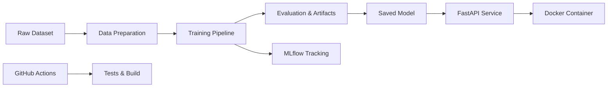

# Jamboree Admission Predictor

> An end-to-end machine learning application that predicts a student's chance of admission to a graduate program from academic and profile-related inputs. The project demonstrates a production-minded workflow: reproducible training, experiment tracking, a REST API, containerization, automated tests, and continuous integration.

[](https://github.com/Ayush-Singh2309/jamboree-admission-predictor/actions/workflows/ci.yml)

<!-- ADD DEPLOYMENT URL HERE -->
<!-- Example: **Live API:** [https://your-app.example.com](https://your-app.example.com) -->

<!-- ADD ARCHITECTURE IMAGE OR DIAGRAM HERE -->
<!-- Suggested path: docs/images/project-architecture.png -->

## Project Overview

Jamboree Admission Predictor estimates the probability that an applicant will receive a graduate-school admission offer. It packages the full machine learning lifecycle into a maintainable application—from data preparation and model evaluation to an API that can serve predictions.

The project is designed as a portfolio-quality, production-oriented example rather than only a notebook-based analysis.

## Business Problem

Graduate-admission applicants often want a realistic, data-informed estimate of their admission prospects before building their shortlist. This application uses historical applicant information to predict **Chance of Admit**, helping users understand how profile attributes such as GRE score, TOEFL score, university rating, SOP/LOR strength, CGPA, and research experience relate to admission outcomes.

> Predictions are informational estimates, not admissions decisions or guarantees.

## Features

- Reproducible data loading, preprocessing, training, and evaluation pipeline
- Model experimentation with tracked parameters, metrics, and artifacts
- Persisted trained model for repeatable inference
- FastAPI-based REST API with interactive Swagger documentation
- Input validation through Pydantic schemas
- Automated tests with `pytest`
- Docker support for consistent local and deployment environments
- CI workflow with GitHub Actions

## Project Architecture



<!-- ADD ARCHITECTURE IMAGE HERE IF YOU PREFER AN IMAGE OVER THE DIAGRAM ABOVE -->

## Folder Structure

```text
jamboree-admission-predictor/
├── app/                    # FastAPI application and API schemas
├── src/                    # Training, preprocessing, and utility modules
├── tests/                  # Unit and API tests
├── notebooks/              # Exploratory data analysis notebooks
├── data/
│   ├── raw/                # Original dataset
│   └── processed/          # Cleaned or transformed data
├── artifacts/              # Model, metrics, plots, and predictions
├── .github/workflows/      # GitHub Actions CI configuration
├── Dockerfile
├── requirements.txt
├── README.md
└── LICENSE
```

<!-- Update this tree if your repository uses different names or adds directories. -->

## Tech Stack

| Area | Tools |
| --- | --- |
| Language | Python |
| Data & ML | pandas, NumPy, scikit-learn |
| Experiment tracking | MLflow |
| API | FastAPI, Uvicorn, Pydantic |
| Testing | pytest |
| Containerization | Docker |
| CI/CD | GitHub Actions |

<!-- Replace or extend this table to match your actual dependencies. -->

## Dataset

The model is trained on the **Jamboree Admission** dataset, which contains applicant-level academic and profile features along with the target variable, `Chance of Admit`.

Typical input features include:

- GRE Score
- TOEFL Score
- University Rating
- Statement of Purpose (SOP) strength
- Letter of Recommendation (LOR) strength
- Undergraduate CGPA
- Research experience

<!-- ADD DATASET LINK HERE -->
<!-- Example: Dataset source: [Kaggle — Graduate Admissions](https://www.kaggle.com/datasets/...) -->

<!-- ADD DATASET SUMMARY HERE: number of rows, missing values, train/test split, and any license notes. -->

## Experimentation

Multiple regression models can be evaluated to select the most reliable approach for the problem. Typical candidates include Linear Regression, Ridge Regression, Lasso Regression, Random Forest, and Gradient Boosting.

Models should be compared using held-out test data and regression metrics such as R², RMSE, and MAE. The selected model is then serialized and used by the inference API.

<!-- ADD MODEL COMPARISON TABLE HERE -->

| Model | Test R² | RMSE | MAE |
| --- | ---: | ---: | ---: |
| <!-- Add model name --> | <!-- Add value --> | <!-- Add value --> | <!-- Add value --> |

## Training Pipeline

The training workflow follows these stages:

1. Load the raw dataset.
2. Validate columns and clean missing or inconsistent values.
3. Split the data into training and test sets.
4. Fit the preprocessing and model pipeline.
5. Evaluate performance on unseen test data.
6. Save the trained model and evaluation artifacts.
7. Log parameters, metrics, and artifacts to MLflow.

<!-- ADD TRAINING PIPELINE DIAGRAM HERE -->
<!-- Suggested path: docs/images/training-pipeline.png -->

## MLflow Tracking

MLflow records each experiment run, including model parameters, evaluation metrics, and generated artifacts. This makes it easier to compare experiments and reproduce the selected model.

Start the MLflow UI locally with:

```bash
mlflow ui
```

Then open `http://127.0.0.1:5000` in your browser.

<!-- ADD MLFLOW EXPERIMENT SCREENSHOT HERE -->
<!-- ADD MLFLOW RUN METRICS SCREENSHOT HERE -->
<!-- ADD MLFLOW ARTIFACTS SCREENSHOT HERE -->

## FastAPI API

The trained model is exposed through a FastAPI service. Once running, interactive documentation is available at:

```text
http://127.0.0.1:8000/docs
```

<!-- ADD SWAGGER SCREENSHOT HERE -->

<!-- ADD DEPLOYED SWAGGER URL HERE -->

## Docker

Docker packages the application and its dependencies into a portable image, ensuring the API behaves consistently across environments.

<!-- ADD DOCKER IMAGE / CONTAINER SCREENSHOT HERE (OPTIONAL) -->

## CI/CD

GitHub Actions runs automated checks on pushes and pull requests. A typical workflow installs dependencies, runs tests, and can optionally build the Docker image or deploy the service.

<!-- ADD GITHUB ACTIONS WORKFLOW SCREENSHOT HERE -->
<!-- ADD GITHUB ACTIONS BADGE HERE IF NOT ADDED AT THE TOP -->

## Installation

### Prerequisites

- Python 3.10 or later
- `pip`
- Docker (optional, for containerized usage)

### Clone and set up

```bash
git clone https://github.com/<your-username>/<your-repository>.git
cd <your-repository>

python -m venv .venv
source .venv/bin/activate  # Windows: .venv\Scripts\activate

pip install -r requirements.txt
```

## Local Usage

### Train the model

```bash
python src/models/train.py
```

<!-- Update this command if your training entry point differs. -->

Training produces the saved model and evaluation outputs in `artifacts/`.

### Serve the API

```bash
uvicorn app.api:app --reload
```

Open the Swagger UI at `http://127.0.0.1:8000/docs`.

<!-- Update `app.api:app` if your FastAPI application has a different import path. -->

### Run tests

```bash
pytest
```

## Docker Commands

Build the image:

```bash
docker build -t jamboree-admission-predictor .
```

Run the container:

```bash
docker run --rm -p 8000:8000 jamboree-admission-predictor
```

Visit `http://127.0.0.1:8000/docs` after the container starts.

<!-- Update the image name, port, or command to match your Dockerfile. -->

## API Examples

### Health check

```bash
curl http://127.0.0.1:8000/health
```

### Prediction request

```bash
curl -X POST "http://127.0.0.1:8000/predict" \
  -H "Content-Type: application/json" \
  -d '{
    "gre_score": 320,
    "toefl_score": 110,
    "university_rating": 4,
    "sop": 4.5,
    "lor": 4.5,
    "cgpa": 9.1,
    "research": 1
  }'
```

Example response:

```json
{
  "predicted_chance_of_admit": 0.82
}
```

<!-- Verify endpoint paths, input field names, and response field names against your implementation. -->

## Results

<!-- ADD FINAL TEST METRICS HERE -->

| Metric | Value |
| --- | ---: |
| Test R² | <!-- Add value --> |
| Test RMSE | <!-- Add value --> |
| Test MAE | <!-- Add value --> |

<!-- ADD RESIDUAL PLOT HERE -->
<!-- ADD ACTUAL VS PREDICTED PLOT HERE -->
<!-- ADD COEFFICIENT OR FEATURE-IMPORTANCE PLOT HERE, IF APPLICABLE -->

## Future Improvements

- Add data and model validation checks with tools such as Great Expectations or Evidently.
- Add hyperparameter optimization and model selection automation.
- Introduce model and data versioning with DVC.
- Add monitoring for prediction drift and API performance after deployment.
- Add authentication, rate limiting, and structured logging to the API.
- Deploy the container to a cloud platform with automated release workflows.

## Acknowledgements

- Jamboree Education / the original dataset provider for the admissions dataset.
- The open-source communities behind scikit-learn, FastAPI, MLflow, Docker, and pytest.

<!-- ADD COURSE, MENTOR, OR DATASET ATTRIBUTION DETAILS HERE IF REQUIRED. -->

## License

This project is licensed under the [MIT License](LICENSE).

<!-- Add a LICENSE file to the repository, or change this section to match your chosen license. -->
